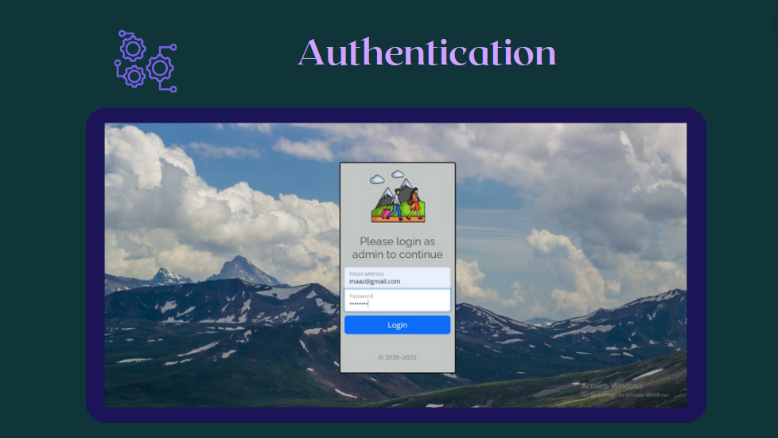

# Ready To Go Travels

RTG (Ready to Go) Travels is a travel agency devoted to providing the best possible experience to its users. It is an online travel booking website that provides comprehensive information about the   offered destinations, the best itineraries, top-notch amenities, and an unforgettable experience all while giving the users the ability to book tours online without any hassle. For the cs350 Web Engineering project, the aim of the group was to design and build a cutting-edge, professional website for this travel agency. Using this website, the users will be able to sign up, book tours from a list of pre-prepared travel packages or customize a travel package that is tailored to their needs. Moreover, the travelers can explore the website to gain assistance for planning their next trip. The responsive script and layout have been designed through HTML, CSS and Bootstrap v.5.2.3. The server-side programming has been achieved through php and Laravel with the database records stored in a mysql database.

## Website

**_Built using Laravel, MySQL, and various web technologies._**

## 🚀 Objectives

👉 Provide a dynamic and interactive platform for booking trips and tours.  
👉 Enable advanced search and filtering options for users.  
👉 Offer customizable tour recommendations based on user preferences.  
👉 Ensure secure transactions and data management.  

## Features and Functionality

📚 Dynamic fetching and display of trips from the database.  
📚 Advanced search and filtering capabilities.  
📚 Customizable tour recommendations.  
📚 Interactive maps for location-based services.  
📚 Secure user authentication and transaction processing.  
📚 User reviews and ratings for trips and tours.  
📚 Responsive design for accessibility on all devices.  
📚 Admin dashboard for managing bookings and special offers.  

## Authentication

## Tours & Trips

## Admin Panel

## Database Tables

1. **Users:** Stores the registered user details.
2. **Usertrips:** Stores the reservations made by the users to display on reservations page.
3. **Team:** Stores the details of the team members displayed on packages page.
4. **Reviews:** Stores the FAQ posts uploaded by the authenticated users.
5. **Assets:** Stores the images and their respective locations to be fetched.

## How to Build and Run

1. **Download and Install XAMPP:**  
   Install XAMPP with default ports 80 and 3306 for Apache and MySQL respectively.

2. **Run XAMPP Services:**  
   Start Apache and MySQL services in XAMPP.

3. **Install Laravel:**  
   Install Laravel 8/9.

4. **Place the Project:**  
   Place the 'new' named project in any directory.

5. **Navigate to Project Directory:**  
   Open command prompt and enter the project's directory.

6. **Set Up Database:**  
   Open PhpMyAdmin on localhost and paste the queries from `sql.txt` on the SQL query builder.
   Note: Replace the local images paths in `sql.txt` with the respective directory where you placed your project.

7. **Start the project**  
   php artisan serve

7. **Access the Application:**  
   Navigate to 127.0.0.1:8000/ in a browser to visit the project.

## Technologies Used
1. **Laravel:** For backend development and RESTful APIs.
2. **MySQL:** For database management and real-time data handling.
3. **HTML/CSS/JavaScript:** For frontend development and UI/UX design.
4. **Bootstrap:** For responsive design and layout.
5. **NPM:** For dependency management.
6. **Git:** For version control.

NOTE: PLEASE LET ME KNOW IF YOU DISCOVERED ANY BUG OR YOU HAVE ANY SUGGESTIONS

